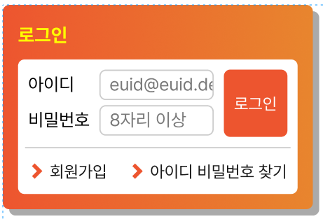

# 멋쟁이 사자처럼 프론트엔드 스쿨 6기 2번째 과제

## 로그인 박스 만들기

### 조건

> - 마크업 순서
>   1. 로그인(제목)
>   2. 아이디, 비밀번호(레이블과 입력 서식)
>   3. 로그인 버튼
>   4. 회원가입 및 아이디 비밀번호 찾기(링크)
> - 이미지 없이 모든 디자인을 CSS로 구현
> - position 속성 활용
> - 회원가입 및 아이디 비밀번호 찾기 영역은 float를 활용

##
