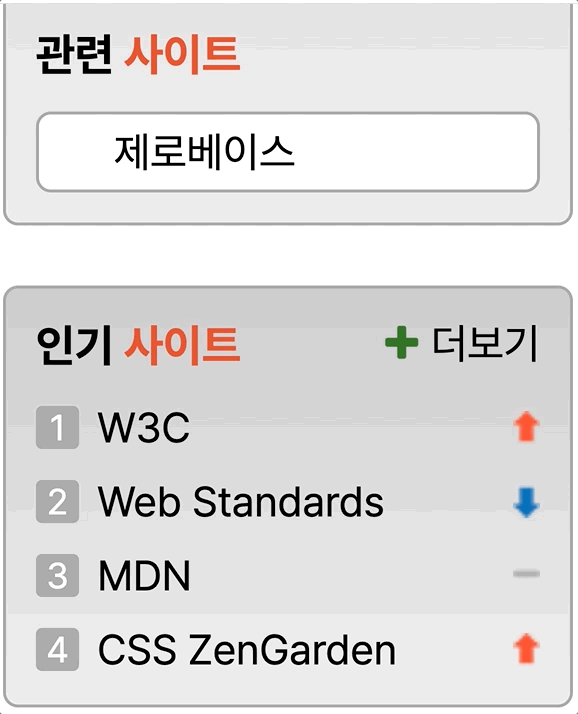
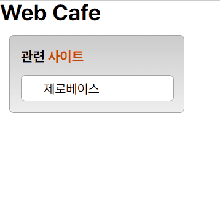

# 멋쟁이 사자처럼 프론트엔드 스쿨 6기 3번째 과제

## transition 과제 (관련 사이트 영역)



### 조건

1. '관련 사이트'는 제목으로, 각각 항목은 링크로 구현
2. 링크 목록 중 1개만 보이도록 CSS로 구현
3. 목록에 마우스를 올리면 5개 목록이 펼쳐지도록 구현
4. transition 속성을 활용하여 애니메이션 효과 구현

## 코드 설명

### HTML

```
<h2 class="title">
  <span>관련 </span><span class="title__orange">사이트</span>
</h2>
```

'관련 사이트'에서 '사이트'만 컬러를 주기 위해 span 태그를 사용함

```
<div class="subBox">
  <ul class="linkBox">
    <li><a href="/" class="link">제로베이스</a></li>
    <li><a href="/" class="link">W3C</a></li>
    <li><a href="/" class="link">데이원 컴퍼니</a></li>
    <li><a href="/" class="link">웹 접근성 연구소</a></li>
    <li><a href="/" class="link">MDN</a></li>
  </ul>
</div>
```

각각의 링크는 순서가 상관없기 때문에 ul과 li로 그룹화하였고, transition 속성을 부여하기 위해 ul태그를 div태그로 감싸주었음

### CSS

```
.subBox {
  transition-property: all;
  transition-duration: 0.5s;
  overflow: hidden;

  width: 166px;
  height: 29px;

  margin-top: 8px;

  border: 1px solid #a3a3a3;
  border-radius: 5px;

  background: #fff;
}

.subBox:hover {
  height: 145px;
}
```

하얀색 박스 영역에 hover되면 목록이 열리도록 transition 속성 추가

```
.linkBox {
  transition-property: all;
  transition-duration: 0.5s;
  transition-delay: 0.2s;

  padding-left: 24px;
}

.linkBox:hover {
  padding-top: 13px;
}
```

목록이 열리고 나서 잠시 뒤에 목록이 밑으로 살짝 내려가도록 transition 속성 추가

## 결과물



샘플대로 구현한듯 보이지만, ul 태그 위에 살짝 공간이 벌어졌고 그부분에 마우스를 올리면 링크 목록이 내려가는 transition이 작동을 하지 않는다.
