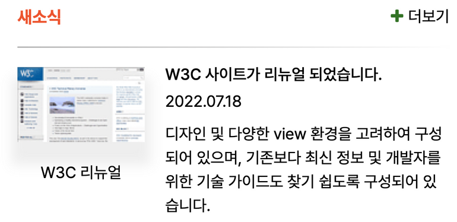
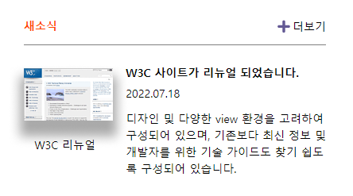

# 멋쟁이 사자처럼 프론트엔드 스쿨 6기 4번째 과제

## grid 과제 (새소식 영역)



### 조건

1. 'W3C 리뉴얼'이라는 캡션 위에 이미지 삽입
2. 이미지는 img태그 사용
3. grid를 활용하여 레이아웃 구현

## 코드 설명

### HTML

```
<figure class="news__image">
  
  <figcaption>W3C 리뉴얼</figcaption>
</figure>
```

이미지 요소는 figure태그로 감싸주고 figcaption태그를 사용한다. figcaption으로 이미지의 설명을 해줬기 때문에 대체텍스트는 비워둔다.

<br>

```
<h3 class="news__title">W3C 사이트가 리뉴얼 되었습니다.</h3>
<p class="news__date">2022.07.18</p>
<p class="news__text">
  디자인 및 다양한 view 환경을 고려하여 구성되어 있으며, 기존보다 최신 정보 및 개발자를
  위한 기술 가이드도 찾기 쉽도록 구성되어 있습니다.
</p>
```

새소식의 타이틀을 표시해주기 위해 h3태그를 사용하였고, 나머지는 p태그를 사용하였다.

<br>

### CSS

```
.newsBoxHead {
  display: flow-root;
  margin-bottom: 12px;
}
```

'새소식'과 '더보기'를 float로 띄워 좌우에 배치하였고, 하단의 구분선과의 여백을 주기 위해 div태그로 감싸주고 flow-root값을 주었다.

<br>

```
.news {
  clear: both;
  display: grid;
  grid-template-columns: repeat(6, 1fr);
  grid-template-rows: auto;
  grid-template-areas:
    "image image title title title title"
    "image image date date date date"
    "image image text text text text";
  gap: 5px;

  padding-top: 24px;

  border-top: 1px solid gray;
}
```

구분선을 기준으로 하단의 요소들을 배치하기 위해 grid를 사용하였고, column은 6칸으로 나누어서 grid-template-areas 속성을 사용하여 배치하였다.

## 결과물



구분선에 대한 그래디언트 효과같은 디자인적인 요소는 정확하게 구현하지는 않았고,<br>
grid 속성을 사용해보는 데에 중점을 두었다.
