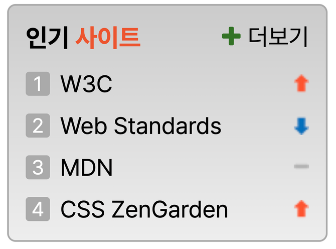
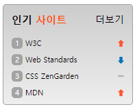

# 멋쟁이 사자처럼 프론트엔드 스쿨 6기 5번째 과제

## sprite 과제 (인기 사이트 영역)



### 조건

1. 더보기 링크 앞의 기호는 생략 가능
2. 등락 표시 이미지를 스프라이트 기법을 활용하여 스타일링
3. 순위는 ol 요소에서 제공하는 기본 숫자를 보이지 않게 한 후 CSS로 구현한다

## 코드 설명

### HTML

```
<ol class="favoriteSite__rank">
  <li class="favoriteSite__link link1">
    <a href="/">W3C</a>
    <span class="rank1UpDown" role="img" aria-label="순위 상승"></span>
  </li>
```

순위는 순서가 중요하기 때문에 ul태그가 아닌 ol태그를 사용하였고, 각 li 안에는 해당 사이트로 이동하기 위한 a태그와 순위 등락표시를 삽입하기 위한 span태그를 삽입하였다. span태그 안에는 내용을 추가하지 않았지만 스크린 리더로 읽어주기 위해 aria-lable 속성을 부여했고, span태그는 시맨틱 요소가 아니기 때문에 role 속성을 주었다. 이미지로 순위 등락 표시를 하였기 때문에 role속성의 값으로는 img를 사용했다.

<br>

### CSS

```
.favoriteSite__rank {
  display: flex;
  flex-direction: column;
  row-gap: 0.5rem;

  padding-left: 0;

  list-style: none;
}
```

각 사이트들 사이의 간격을 주고, 세로로 정렬하기 위해 flex속성과 row-gap속성을 사용하였다.

<br>

```
.favoriteSite__link {
  display: grid;
  grid-template-columns: 1.25rem max-content 1fr;

  font-size: 0.6875rem;
  color: black;
}
```

각 사이트의 영역에서 순위 | 사이트 명 | 등락표시를 grid 속성을 사용하여 배치하였다.

<br>

```
.favoriteSite__link::before {
  width: 16px;
  height: 16px;

  border-radius: 5px;

  text-align: center;
  color: white;

  background: #a3a3a3;
}

.link1::before {
  content: "1";
}
```

ol태그를 삽입했을 때 나오는 순위 표시는 삭제하고, 가상 요소 선택자를 사용하여 박스와 숫자를 삽입하였다.

<br>

```
[class*="UpDown"] {
  width: 9px;
  height: 11px;

  justify-self: end;
  align-self: center;
  background: url(./images/rank.png) no-repeat;
}

.rank1UpDown,
.rank4UpDown {
  background-position: 0 0;
}
```

순위 등락 표시는 스프라이트 기법을 사용하여 이미지를 삽입하였다.

<br>

```
.favoriteSite__more {
  position: absolute;
  top: 0.75rem;
  right: 0.75rem;

  font-size: 0.875rem;
  font-weight: 400;
}

```

'더보기' 링크는 모든 사이트의 나열이 끝난 뒤에 마크업하였기 때문에, absolute 값을 부여해서 부모 요소의 우측 상단에 배치하였다.

<br>

## 결과물



부모 요소에 flex, 자식 요소에 grid를 사용하여 배치하였다. 스프라이트 기법 사용 시 이미지의 좌표 값을 어떻게 찾는지 몰라 검색해서 나온 사이트에서 좌표값을 찾아 이용하였다.
